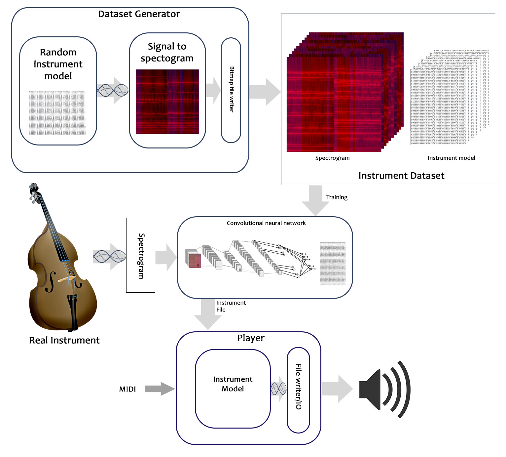

# SoundLearner #
*A machine learning approach to modeling musical instruments or sounds.

This C++17 and python Tensorflow project intends to create an model for a musical instrument, where sound is deconstructed into individual sine waves that follow a basic amplitude and frequency envelope. 
Furthermore, using a convolutional neural network, unheard instrument recordings can then be mapped  to parameters for the instrument model. Later the instruments model can be used in a player application to accurately recreate the original instrument for new MIDI inputs.

- - - -

##  Summary and Goals ##
This projects contains a 5 modulised applications:-

1. Dataset Generator
2. Tensorflow convolutional neural network based soundl learner
3. Genetic algorithm based sound learner
4. Spectogram generator
5. Player

The goal of the project is to use machine learning to develop instrument model capable of accurately synthesizing the sound of actual instrument recordings. Then Using a raspberry pi and a midi instrument, generate the synthesized audio in real time to a audio device.

## Milestones ##

#### Sound learner ####
* [x] Develop *oscillator* based Instrument model
* [x] Add basic wave file read and write
* [x] Add *Instrument model* file write
* [ ] Add basic mid/midi file read
* [x] Train instrument model with piano sound sample
* [ ] Build Deep learning based training framework
* [x] Build Deep learning Dataset
* [ ] Train generlised deep leaning instrument generator
* [ ] Test instrument generator with real instrument sounds
* [ ] Standalone spectogram generator
* [ ] Create Mel Spectograms

#### Player ####
* [ ] Read midi input from IO
* [x] Open *Instrument model* files
* [x] Open *Instrument model* files
* [x] Write to wave file
* [ ] Playback to audio device
* [ ] Add polyphony playback
* [ ] Add stereoization
* [ ] ...* Future changes and new ideas*
