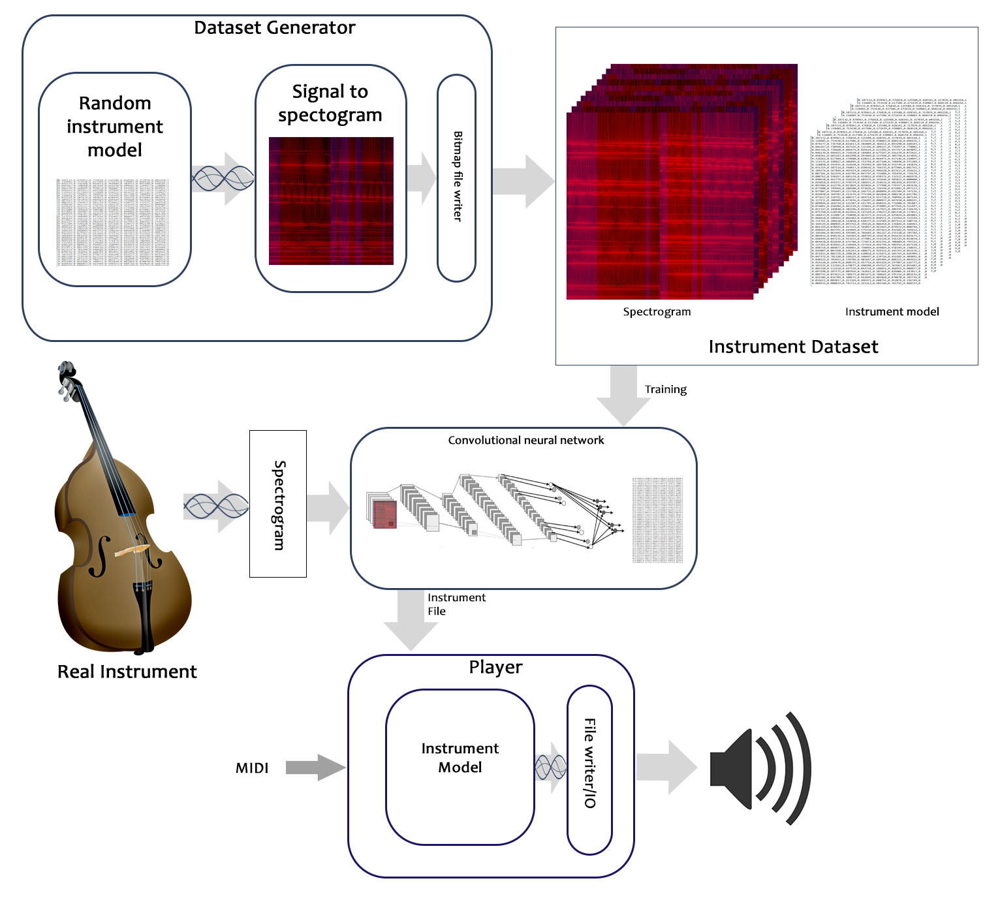

# SoundLearner

SoundLearner is an experiment in learning a compact synthesizer model from audio.

The project generates labelled audio from an oscillator-based instrument model, extracts fixed-size audio feature tensors, and aims to train a model that maps an input sound back to synthesizer parameters. The long-term goal is not just to classify sounds, but to recover enough structure that the player can resynthesize similar sounds from MIDI, embedded instruments, and eventually DAW plugin workflows.



## Current Shape

SoundLearner is being modernized from an older C++17 and TensorFlow 1.x project into a cleaner C++23 dataset and feature pipeline, with the ML architecture intentionally left open for redesign.

The repo currently contains:

1. `instrument` - oscillator-based sound generation.
2. `dataset_builder` - synthetic training data generation with known oscillator labels.
3. `feature_extractor` - WAV to fixed-size feature tensor conversion.
4. `deep_trainer` - PyTorch training and prediction pipeline for `.slft` tensors.
5. `player` - instrument model loading and WAV rendering.
6. `Analyse` - older analysis scripts and experiments.

## Playback Roadmap

The model is only useful if it can become an instrument. There are two important playback targets:

1. Raspberry Pi digital piano app.
2. DAW plugin, likely as a modern VST-style shared library.

The Raspberry Pi app is the first practical target after training succeeds. It should load a trained instrument model, accept MIDI input from a digital piano or MIDI controller, and render audio in real time to an audio device. This is the main "can this become an instrument?" milestone.

The DAW plugin is a longer-term target. A VST-style plugin would let the learned model live inside modern music production workflows, but it will likely require substantial extra work around plugin SDKs, realtime-safe audio processing, host automation, packaging, presets, UI, and cross-platform builds.

## Build

The C++ tools are built with Meson and C++23.

```bash
meson setup build -Dcpp_std=c++23
meson compile -C build
```

If the build directory already exists:

```bash
meson setup build --reconfigure -Dcpp_std=c++23
meson compile -C build
```

The native tools currently depend on FFTW3.

## Developer Tooling

The repo includes project-level Clang tooling:

```text
.clang-format       formatting rules for C++23-era code
.clangd             clangd editor/indexing configuration
meson/clang.ini     optional Meson native file for Clang builds
AGENTS.md           quick-start notes for future Codex/LLM sessions
```

`clangd` is configured to read `build/compile_commands.json`, so generate or reconfigure the default build directory before relying on editor diagnostics.

Automation helpers:

```text
scripts/build_school_v1.bat   build the current school dataset ladder
scripts/train_school_v1.bat   train, evaluate, and analyze the current school ladder
```

To build with Clang once `clang++` is installed:

```bash
meson setup build-clang --native-file meson/clang.ini
meson compile -C build-clang
```

The provided native file currently uses Ubuntu's versioned `clang++-18` binary. If your system provides an unversioned `clang++`, update `meson/clang.ini` accordingly.

To run a strict warning pass with the currently available compiler:

```bash
meson setup build-warnings --wipe -Dcpp_std=c++23 -Dwerror=true
meson compile -C build-warnings
```

## Dataset Builder

`dataset_builder` creates labelled synthetic examples from the oscillator instrument model.

```bash
./build/dataset_builder/dataset_builder
```

Useful options:

```text
-n --num-samples <count>       number of examples to generate
-t --sample-time <seconds>     generated clip length
-r --resolution <pixels>       feature and preview resolution
--min-instrument-size <count>  minimum coupled oscillator count per sample
--max-instrument-size <count>  maximum coupled oscillator count per sample
--min-uncoupled-oscilators     minimum uncoupled oscillator count per sample
--max-uncoupled-oscilators     maximum uncoupled oscillator count per sample
--write-ppm-preview            also write PPM preview images
```

Old fixed-count flags still work:

```text
-s --instrument-size <count>
-c --uncoupled-oscilators <count>
```

but they now mean "use the same count for every generated sample". For more realistic datasets, prefer per-sample ranges:

```bash
./build/dataset_builder/dataset_builder -n 1000 -t 5 --min-instrument-size 8 --max-instrument-size 64 --min-uncoupled-oscilators 0 --max-uncoupled-oscilators 12 --freq-bins 1024 --time-frames 512
```

Outputs include:

```text
dataN.wav                      generated audio
dataN.data                     legacy oscillator data
dataN.meta                     legacy metadata
features/dataN.slft            canonical feature tensor
metadata/dataN.json            structured metadata
preview/dataN_rgb.bmp          linear-frequency RGB preview
preview/dataN_logfreq_rgb.bmp  log-frequency RGB preview
```

By default, preview images are BMP RGB files. PPM files are only written when requested.

## Feature Extractor

`feature_extractor` converts a WAV file into the same feature tensor format used by the generated dataset.

```bash
./build/feature_extractor/feature_extractor -i input.wav -o output.slft
```

Useful options:

```text
-i --input <input.wav>         source WAV file
-o --output <output.slft>      feature tensor output
-r --resolution <pixels>       output tensor resolution, default 512
--freq-bins <pixels>           frequency bins, overrides square resolution
--time-frames <pixels>         time frames, overrides square resolution
-p --preview-prefix <path>     optional preview image prefix
-t --crop-seconds <seconds>    fixed analysis window, default 5
--crop-start-seconds <seconds> crop offset, default 0
--write-ppm-preview            also write a PPM preview
```

The extractor uses fixed-window cropping. Long WAV files are cropped. Short WAV files are zero-padded. This avoids stretching the time axis, which would hide the true temporal scale of the sound.

`--resolution` is square shorthand. For higher frequency detail without exploding memory, prefer rectangular tensors:

```bash
./build/feature_extractor/feature_extractor -i input.wav -o output.slft --freq-bins 2048 --time-frames 512 -p preview/input
```

## Dataset Augmentation

The new Python-side augmentor lets us build alternate schools of synthetic datasets that keep the same oscillator labels but pass the audio through a more recording-like world before feature extraction.

```bash
python -m deep_trainer.dataset_augmentor --input-root datasets/synth_1024x512_1k --output-root datasets/synth_1024x512_1k_realish --variants-per-input 2 --tool-mode wsl
```

This is the preferred place to experiment with:

- gain variation
- noise floor
- tone tilt
- tiny room coloration
- mild saturation

That keeps the C++ generator focused on clean instrument synthesis while letting the Python side iterate quickly on synthetic-to-real bridging.

The augmentor now also writes Python-generated mel spectrogram PNGs under `mel_preview/`, which are much nicer for inspecting processed datasets than the old preview path alone.

## Feature Tensor

The current canonical model input is a compact binary `.slft` tensor:

```text
magic:        SLFT
version:      1
sample_rate:  44100
shape:        channels x frequency_bins x time_frames
data:         float32, channel-major
```

Current channels:

1. Log-frequency magnitude.
2. Temporal delta.
3. Onset emphasis.

Preview images are for humans. The ML model should train on `.slft` tensors, not on BMP or PPM files.

## ML Architecture Direction

The old `deep_trainer` CNN was designed around 512 px images and TensorFlow 1.x. That was reasonable for a small GPU years ago, but it is no longer the best center of gravity for this project.

The strongest next architecture is likely not a plain image CNN and not diffusion as the first model. The recommended first serious model is:

```text
audio feature tensor
  -> modern audio/image encoder
  -> latent embedding
  -> structured oscillator-parameter heads
  -> optional differentiable or offline resynthesis loss
```

### Why Not Start With Diffusion?

Diffusion models are excellent generative models, especially when the output is high dimensional and there are many valid answers. This project has an inverse problem: map audio to a compact set of oscillator parameters.

Diffusion could help later because many oscillator configurations may sound similar. That makes the target distribution multi-modal. A diffusion head could sample multiple plausible parameter sets instead of predicting one average answer.

However, diffusion is heavier to train, slower to evaluate, and harder to debug. On a 12GB GPU it is possible, but it adds complexity before the project has a strong supervised baseline. The first milestone should be a model that predicts parameters directly and can be evaluated clearly.

Recommended path:

1. Build a strong supervised encoder-regressor baseline.
2. Add uncertainty or mixture-density outputs for ambiguous parameters.
3. Add audio reconstruction/resynthesis metrics.
4. Consider diffusion only if the direct model collapses ambiguous sounds into bad average parameters.

### Recommended Baseline

Use a modern ConvNet-style encoder over the `.slft` tensor.

Good first choices:

1. ConvNeXt-Tiny style encoder.
2. EfficientNetV2-small style encoder.
3. ResNet with modern training choices if simplicity matters most.

The model output should be structured, not a single flat vector if avoidable.

Suggested heads:

```text
global sound embedding
  -> oscillator count / activity head
  -> frequency trajectory head
  -> amplitude envelope head
  -> phase / waveform / modulation head, if retained
  -> confidence or uncertainty head
```

This better matches the synthesizer domain than treating the output as unrelated regression numbers.

### Transformer Option

An Audio Spectrogram Transformer or small hierarchical transformer is also reasonable, especially if the input resolution grows beyond 512 or if longer clips are used.

For a 12GB GPU, a full large transformer is probably not the best first move. A small AST-like model or hybrid ConvNet-plus-attention model is more practical.

Use a transformer when:

1. The model needs longer temporal context.
2. The feature tensor resolution becomes large.
3. Pretraining on real unlabeled audio becomes important.
4. The ConvNet baseline misses long-range time/frequency relationships.

### Probabilistic Output

A single set of oscillator parameters may not be the only valid answer for a real sound. This matters for piano, birds, voice, percussion, and noisy recordings.

Instead of forcing one answer, the model should eventually expose uncertainty:

1. Predict mean and variance for continuous parameters.
2. Use a mixture density head for parameters with multiple plausible values.
3. Predict top-k candidate instruments and resynthesize all candidates.
4. Rank candidates by audio reconstruction quality.

This gives the project a path toward "several good approximations" rather than pretending there is one perfect inverse.

### Real Audio Evaluation

Generated oscillator audio is the training dataset because it has perfect labels. Real audio should be used as the test and performance benchmark.

Real audio examples:

1. Piano notes.
2. Plucked strings.
3. Bowed strings.
4. Human whistle or voice vowels.
5. Bird chirps.
6. Percussion and transient sounds.

For real audio there may be no ground-truth oscillator labels. Evaluation should therefore include audio-domain metrics:

1. Resynthesize predicted parameters.
2. Compare input audio and rendered audio.
3. Measure spectral distance, multi-resolution STFT loss, onset timing, pitch contour, and loudness envelope.
4. Keep human preview spectrograms for qualitative debugging.
5. Build a small curated listening/evaluation set that never appears in training.

The most important test is not whether the model matches generated labels. It is whether predicted parameters resynthesize convincing audio for sounds outside the oscillator generator.

### Synthetic-To-Real Gap

The main ML risk is domain gap. A model trained only on clean generated oscillator sounds may fail on piano, birds, room noise, microphone coloration, compression, and performance variation.

The dataset builder should eventually add domain randomization:

1. Noise.
2. Room impulse responses.
3. EQ and filtering.
4. Compression and clipping.
5. Pitch drift.
6. Timing jitter.
7. Reverb.
8. Multiple simultaneous partials and transient layers.

The goal is not to make the synthetic data pretty. The goal is to make it broad enough that real audio does not look alien to the model.

### 12GB VRAM Target

A practical training target for a 12GB GPU:

```text
input:        3 x 512 x 512 or 3 x 768 x 768
precision:    mixed precision
batch size:   tune around memory, likely 4-32 depending on encoder
model:        small-to-medium ConvNet or small AST
optimizer:    AdamW
training:     supervised synthetic labels first
validation:   held-out synthetic plus curated real audio benchmark
```

If memory becomes tight, prefer gradient accumulation over shrinking the input too aggressively. The frequency and time resolution are part of the signal.

For oscillator recovery, rectangular inputs are often more useful than very large square inputs. A good high-resolution ladder is:

```text
3 x 512 x 512
3 x 1024 x 512
3 x 2048 x 512
3 x 4096 x 512
```

This spends memory on frequency detail, where oscillator partials live, while keeping time frames manageable.

## Python Trainer

The modern trainer lives in `deep_trainer` and uses PyTorch. It trains directly on `.slft` tensors and predicts structured oscillator slots instead of treating the target as one flat vector.

Install the Python dependencies in your preferred environment:

```bash
python -m pip install -r deep_trainer/requirements.txt
```

PyTorch wheels are usually best installed in a dedicated Python environment that matches your CUDA setup. If the import fails after installation, fix the Torch environment before running the trainer.

Train a first baseline:

```bash
python -m deep_trainer.train --dataset-root . --epochs 50 --batch-size 8 --resolution 512 --amp
```

Predict oscillator CSV rows from a feature tensor:

```bash
python -m deep_trainer.predict --checkpoint runs/baseline/best.pt --feature features/data0.slft --output prediction.data
```

The model currently uses a small ConvNeXt-style encoder and two heads:

1. Oscillator activity logits.
2. Oscillator parameter regression.

The target slot format is:

```text
active
start_amplitude_factor
start_frequency_factor
phase_factor
amplitude_decay_factor
amplitude_attack_factor
frequency_decay_factor
base_frequency_coupled
```

This is intentionally a baseline. It gives the project a measurable supervised model before moving into uncertainty heads, reconstruction losses, or diffusion.

## Proposed ML Milestones

1. Freeze the `.slft` tensor format as the model input.
2. Build a dataset manifest that records audio path, feature path, labels, and generator settings.
3. Replace the TensorFlow 1.x trainer with a modern training stack.
4. Train a ConvNeXt-style supervised baseline on generated data.
5. Render predicted oscillator parameters back to WAV.
6. Score predictions with both parameter loss and audio reconstruction loss.
7. Create a real-audio evaluation set and never train on it.
8. Add domain randomization to the generator.
9. Add uncertainty or mixture-density heads.
10. Revisit diffusion after the baseline exposes where ambiguity is hurting.

## Notes On Diffusion

Diffusion is worth keeping in the design space, but as a second-stage model:

```text
audio encoder embedding
  -> conditional parameter diffusion
  -> sample several plausible oscillator parameter sets
  -> render candidates
  -> rank by audio reconstruction loss
```

This is a good architecture if direct regression produces smeared or average parameters. It is not the fastest route to a useful first model.

## Further Reading

Useful architecture references:

1. [Denoising Diffusion Probabilistic Models](https://arxiv.org/abs/2006.11239)
2. [Denoising Diffusion Implicit Models](https://arxiv.org/abs/2010.02502)
3. [A ConvNet for the 2020s / ConvNeXt](https://arxiv.org/abs/2201.03545)
4. [Audio Spectrogram Transformer](https://arxiv.org/abs/2104.01778)
5. [CLAP: Learning Audio Concepts From Natural Language Supervision](https://arxiv.org/abs/2206.04769)
6. [BEATs: Audio Pre-Training with Acoustic Tokenizers](https://arxiv.org/abs/2212.09058)

## Milestones

### Sound Learner

- [x] Develop oscillator-based instrument model.
- [x] Add basic WAV read and write.
- [x] Add instrument model file write.
- [x] Build generated deep learning dataset.
- [x] Add standalone feature extractor.
- [x] Add flexible feature resolution.
- [x] Add fixed-window crop/pad feature extraction.
- [x] Write canonical `.slft` feature tensors.
- [ ] Add dataset manifest generation.
- [x] Replace legacy TensorFlow trainer.
- [x] Add modern supervised baseline.
- [ ] Train baseline on a full generated dataset.
- [ ] Add audio reconstruction evaluation.
- [ ] Test on real non-generated audio.
- [ ] Add domain randomization.
- [ ] Evaluate probabilistic or diffusion-based parameter heads.
- [ ] Add MIDI file read.

### Player

- [x] Open instrument model files.
- [x] Write to WAV file.
- [ ] Read MIDI input from IO.
- [ ] Playback to audio device.
- [ ] Add polyphonic playback.
- [ ] Add stereoization.
- [ ] Build Raspberry Pi MIDI playback app for digital piano use.
- [ ] Add low-latency realtime audio path.
- [ ] Package learned models for embedded playback.
- [ ] Explore modern VST-style DAW plugin architecture.
- [ ] Build DAW plugin shared library and host integration.
