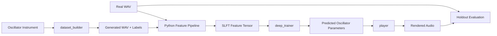

# SoundLearner

SoundLearner is an experiment in learning a compact synthesizer model from audio.

The project generates labelled audio from an oscillator-based instrument model, prepares fixed-size Python-generated audio feature tensors, and aims to train a model that maps an input sound back to synthesizer parameters. The long-term goal is not just to classify sounds, but to recover enough structure that the player can resynthesize similar sounds from MIDI, embedded instruments, and eventually DAW plugin workflows.


```mermaid
flowchart LR
    A["Oscillator Instrument"] --> B["dataset_builder"]
    B --> C["Generated WAV + Labels"]
    D["Real WAV"] --> E["Python Feature Pipeline"]
    C --> E
    E --> F["SLFT Feature Tensor"]
    F --> G["deep_trainer"]
    G --> H["Predicted Oscillator Parameters"]
    H --> I["player"]
    I --> J["Rendered Audio"]
    D --> K["Holdout Evaluation"]
    J --> K
```

## Current Shape

The repo currently contains:

1. `instrument` - oscillator-based sound generation.
2. `dataset_builder` - synthetic training data generation with known oscillator labels.
3. `deep_trainer` - Python feature prep, training, prediction, and evaluation pipeline for `.slft` tensors.
4. `player` - instrument model loading and WAV rendering.
5. `Analyse` - older analysis scripts and experiments.

## Playback Roadmap

The model is only useful if it can become an instrument. There are two important playback targets:

1. Raspberry Pi digital piano app.
2. DAW plugin, likely as a modern VST-style shared library.

The Raspberry Pi app is the first practical target after training succeeds. It should load a trained instrument model, accept MIDI input from a digital piano or MIDI controller, and render audio in real time to an audio device. This is the main "can this become an instrument?" milestone.

The DAW plugin is a longer-term target. A VST-style plugin would let the learned model live inside modern music production workflows, but it will likely require substantial extra work around plugin SDKs, realtime-safe audio processing, host automation, packaging, presets, UI, and cross-platform builds.

## Milestones

### Core Utilities/Tools

- [x] Develop oscillator-based instrument model.
- [x] Add basic WAV read and write.
- [x] Add instrument model file write.
- [x] Build generated deep learning dataset.
- [x] Move feature extraction to the Python ML toolchain.
- [x] Add flexible feature resolution.
- [x] Add fixed-window crop/pad feature extraction.
- [x] Write canonical `.slft` feature tensors.
- [x] Add real-audio holdout evaluation flow.
- [x] Add parameter-space collapse analysis.
- [x] Add local analysis frontend for A/B listening and visual inspection.
- [x] Replace legacy TensorFlow trainer.
- [x] Add modern supervised baseline.
- [x] Add curriculum-based dataset generation.
- [x] Add progressive complexity curriculum scaffolding.
- [ ] Add dataset manifest generation.

### ML Path

- [ ] Train the complexity curriculum end to end with progressive fine-tuning.
- [ ] Improve real-audio holdout performance beyond bland average-solution renders.
- [ ] Add stronger audio-space reconstruction scoring and comparison reports.
- [ ] Improve synthetic data realism without destroying label usefulness.
- [ ] Decide whether the next model step is better losses, better targets, or probabilistic outputs.
- [ ] Revisit uncertainty / mixture outputs before diffusion.

### Audio Engine

- [x] Open instrument model files.
- [x] Write to WAV file.
- [ ] Add polyphonic playback.
- [ ] Add stereoization.
- [ ] Add low-latency realtime audio path.
- [ ] Read MIDI input from IO.
- [ ] Playback to audio device.
- [ ] Build Raspberry Pi MIDI playback app for digital piano use.
- [ ] Package learned models for embedded playback.

### Long-Term Product Path

- [ ] Explore modern VST-style DAW plugin architecture.
- [ ] Build DAW plugin shared library and host integration.

## Quick Start

Build the native tools:

```bash
meson setup build -Dcpp_std=c++23
meson compile -C build
```

Generate a small synthetic dataset:

```bash
./build/dataset_builder/dataset_builder -n 10 -t 5
```

Prepare features from a WAV:

```bash
python -m deep_trainer.prepare_dataset --dataset-root . --freq-bins 512 --time-frames 512 --crop-seconds 5
```

Train the PyTorch baseline:

```bash
python -m deep_trainer.train --dataset-root . --epochs 50 --batch-size 8 --resolution 512 --amp
```

Run the local analysis workbench:

```powershell
.\.venv\Scripts\python.exe -m deep_trainer.analysis_frontend
```

Open `http://127.0.0.1:8765`, drop a WAV, and compare source vs predicted render with mel previews and PCA placement.

The intended flow is:

```text
generated or recorded WAV
  -> fixed-size .slft feature tensor
  -> PyTorch model
  -> predicted oscillator parameters
  -> rendered audio
  -> holdout evaluation
```

## Build

The native audio tools are built with Meson and C++23.

```bash
meson setup build -Dcpp_std=c++23
meson compile -C build
```

If the build directory already exists:

```bash
meson setup build --reconfigure -Dcpp_std=c++23
meson compile -C build
```

## Developer Tooling

The repo includes project-level Clang tooling:

```text
.clang-format       formatting rules for C++23-era code
.clangd             clangd editor/indexing configuration
meson/clang.ini     optional Meson native file for Clang builds
AGENTS.md           quick-start notes for future Codex/LLM sessions
```

`clangd` is configured to read `build/compile_commands.json`, so generate or reconfigure the default build directory before relying on editor diagnostics.

Automation helpers:

```text
scripts/build_datasets.py                 main dataset-build orchestrator
scripts/build_curriculum_v1.bat           wrapper for oscillator_v1 dataset builds
scripts/train_curriculum_v1.bat           train, evaluate, and analyze the current curriculum ladder
scripts/build_complexity_curriculum_v1.bat wrapper for complexity_v1 dataset builds
scripts/train_complexity_curriculum_v1.bat fine-tune through the complexity curriculum stages
```

Set `DATASET_WORKERS` before running the build scripts to fan dataset generation out across multiple `dataset_builder` processes:

```bat
set DATASET_WORKERS=8
scripts\build_complexity_curriculum_v1.bat
```

The orchestration now lives in Python, and the batch files are just thin wrappers.

To build with Clang once `clang++` is installed:

```bash
meson setup build-clang --native-file meson/clang.ini
meson compile -C build-clang
```

The provided native file currently uses Ubuntu's versioned `clang++-18` binary. If your system provides an unversioned `clang++`, update `meson/clang.ini` accordingly.

To run a strict warning pass with the currently available compiler:

```bash
meson setup build-warnings --wipe -Dcpp_std=c++23 -Dwerror=true
meson compile -C build-warnings
```

## Documentation

Detailed implementation notes live under [docs/](./docs/README.md).

Useful links:

- [Dataset Discovery](./docs/dataset-discovery.md)
- [Project Guide](./docs/project-guide.md)
- [Trainer Guide](./docs/trainer.md)

## Core Data Flow

```text
generated or recorded WAV
  -> fixed-size .slft feature tensor
  -> PyTorch model
  -> predicted oscillator parameters
  -> rendered audio
  -> holdout evaluation
```

## Current ML Direction

The current direction is a supervised PyTorch baseline first, then richer probabilistic or generative approaches only after the failure modes are clear.

Recommended shape:

```text
audio feature tensor
  -> modern audio/image encoder
  -> latent embedding
  -> structured oscillator-parameter heads
  -> resynthesis-based evaluation
```

Current priorities:

1. Train a strong encoder-regressor baseline on `.slft` tensors.
2. Evaluate by resynthesizing predicted parameters back to audio.
3. Use real non-generated WAVs as the real benchmark.
4. Add uncertainty or mixture-style outputs only if direct regression keeps collapsing to bland averages.
