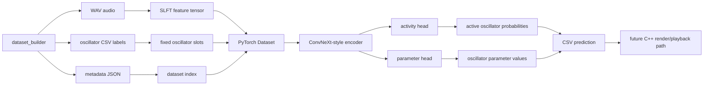
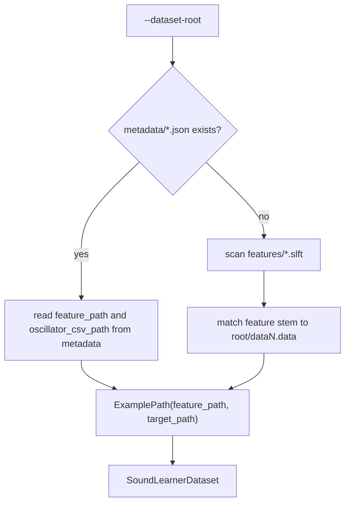
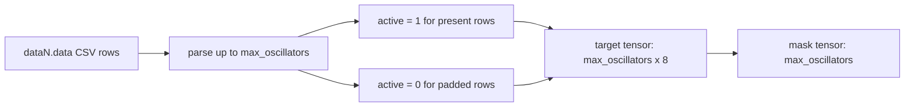
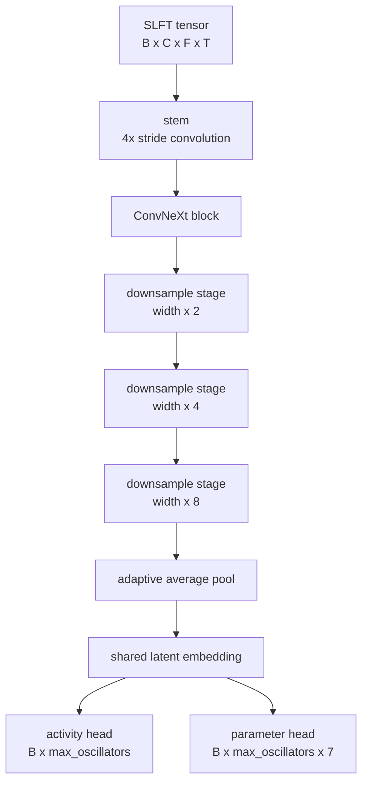
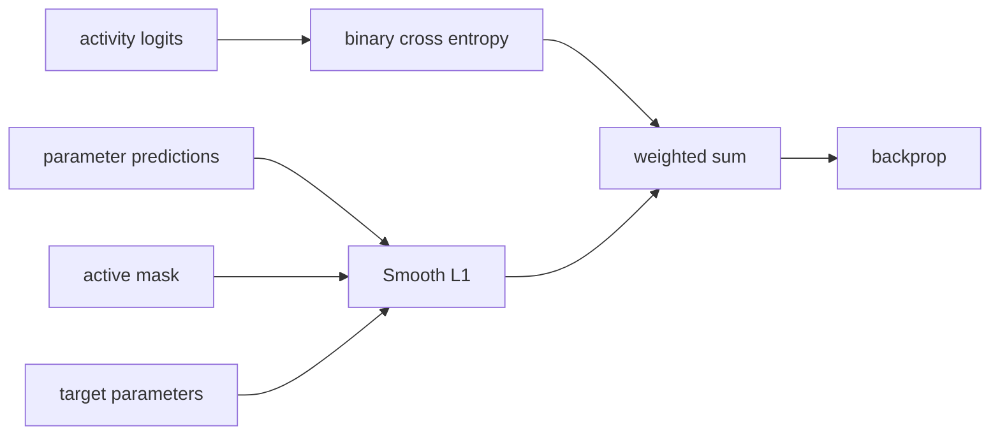
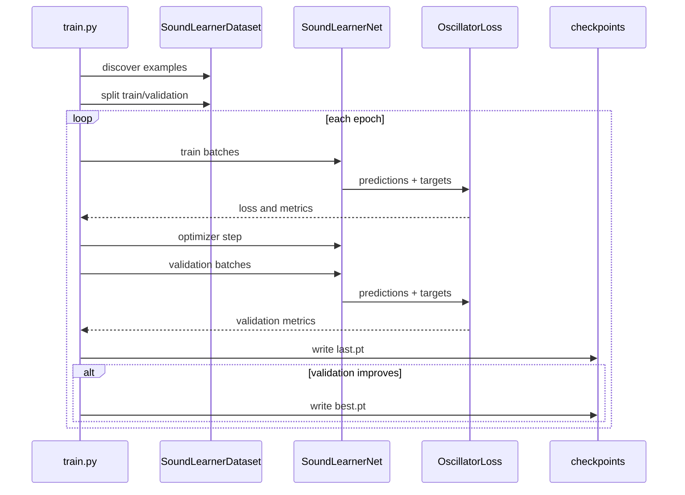
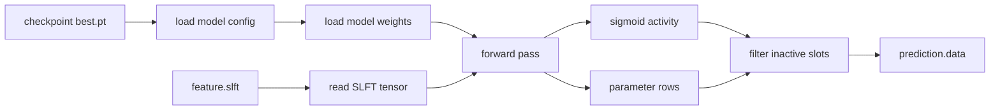

# SoundLearner Trainer

This directory contains the modern ML baseline for SoundLearner.

The legacy TensorFlow 1.x image trainer has been replaced with a PyTorch pipeline that trains directly on `.slft` feature tensors. The current goal is a supervised baseline: map audio features to oscillator-machine parameters, prove the end-to-end path, then improve the model once the failure modes are visible.

## Design Goal

SoundLearner is an inverse synthesis project:

```text
audio clip -> compact oscillator instrument -> rendered audio
```

The trainer does not try to generate waveform samples directly. It predicts the parameters of the existing oscillator model. That keeps the output small, inspectable, and usable by the C++ player.

## Architecture Overview



Generated audio gives us perfect labels. Real audio does not, so real clips should be treated as a performance benchmark after the synthetic baseline works.

## Files

```text
deep_trainer/
  slft.py                 binary .slft reader
  dataset.py              dataset discovery and label loading
  model.py                ConvNeXt-style baseline model
  losses.py               activity + parameter loss
  train.py                training CLI
  predict.py              prediction CLI
  dataset_augmentor.py    audio-domain augmentation for synthetic datasets
  analyze_parameter_space.py
                          PCA/SVD collapse analysis for predicted .data files
  cnn_model_trainer.py    compatibility wrapper for old script name
  model_predictor.py      compatibility wrapper for old script name
  requirements.txt        Python dependencies
```

## Data Layout

The trainer expects data generated by `dataset_builder`:

```text
dataset-root/
  features/
    data0.slft
    data1.slft
  metadata/
    data0.json
    data1.json
  data0.data
  data1.data
```

`metadata/dataN.json` is preferred because it explicitly links the feature tensor to the oscillator CSV target. If metadata is missing, the dataset loader falls back to matching:

```text
features/dataN.slft -> dataN.data
```

### Dataset Discovery



## SLFT Tensor

The `.slft` format is the canonical ML input:

```text
magic:        SLFT
version:      1
sample_rate:  44100
shape:        channels x frequency_bins x time_frames
data:         float32, channel-major
```

Current channels:

1. Log-frequency magnitude.
2. Temporal delta.
3. Onset emphasis.

For a default 512-resolution dataset, one model input has shape:

```text
3 x 512 x 512
```

Rectangular tensors are supported. This is the preferred way to increase frequency detail without making time resolution and memory usage explode:

```text
3 x 1024 x 512
3 x 2048 x 512
3 x 4096 x 512
```

Preview BMP/PPM images are only for humans. The trainer should not depend on image files.

## Label Format

Each instrument is encoded as a fixed number of oscillator slots. The default is `64` slots.

Each slot has 8 values:

```text
active
start_amplitude_factor
start_frequency_factor
phase_factor
amplitude_decay_factor
amplitude_attack_factor
frequency_decay_factor
base_frequency_coupled
```

The `active` flag lets the model represent variable oscillator counts while keeping a fixed output shape.



Rows beyond `--max-oscillators` are ignored. If you generate more oscillator rows than the model can represent, increase `--max-oscillators`.

## Model

The current model is a small ConvNeXt-style encoder, implemented in `model.py`.



The two-head output matters:

1. The activity head predicts which oscillator slots are present.
2. The parameter head predicts values for active oscillator slots.

All parameter outputs are passed through `sigmoid`, because the current oscillator CSV values are normalized to `0..1`.

## Loss

The loss is intentionally simple and inspectable:

```text
total_loss = activity_weight * BCE(activity_logits, active_flags)
           + parameter_weight * masked_smooth_l1(parameters, target_parameters)
```

Default weights:

```text
activity_weight = 1.0
parameter_weight = 10.0
```



The parameter loss is masked so padded inactive slots do not dominate training.

## Training

Install dependencies in a Python environment:

```bash
python -m pip install -r deep_trainer/requirements.txt
```

PyTorch wheels are best installed for your actual CUDA setup. If `import torch` fails, fix the environment before training.

Smoke train:

```bash
python -m deep_trainer.train --dataset-root . --epochs 2 --batch-size 4 --resolution 256 --amp --output-dir runs/smoke
```

Baseline train:

```bash
python -m deep_trainer.train --dataset-root datasets/synth_256_1k --epochs 30 --batch-size 8 --resolution 256 --amp --output-dir runs/baseline_256_1k
```

Rectangular train:

```bash
python -m deep_trainer.train --dataset-root datasets/synth_2048x512_1k --epochs 30 --batch-size 2 --freq-bins 2048 --time-frames 512 --amp --output-dir runs/baseline_2048x512_1k
```

## Dataset Augmentor

`dataset_augmentor.py` creates a sibling dataset that keeps the original oscillator labels but makes the audio feel less sterile before feature extraction.

The intended flow is:

```text
clean synthetic wav + clean oscillator labels
  -> subtle audio-domain augmentation
  -> regenerated .slft features
  -> augmented training dataset
```

This keeps the target instrument unchanged while making the input side look more like a recording world.

Current augmentation stages:

1. random gain
2. low/high tone tilt
3. additive noise at a random SNR
4. tiny sparse reverb
5. mild saturation

Example:

```bash
python -m deep_trainer.dataset_augmentor --input-root datasets/synth_1024x512_1k --output-root datasets/synth_1024x512_1k_realish --variants-per-input 2 --tool-mode wsl
```

Example with the new variable-oscillator generator:

```bash
python -m deep_trainer.dataset_augmentor --input-root datasets/synth_varcount_1024x512_1k --output-root datasets/synth_varcount_1024x512_1k_realish --variants-per-input 2 --tool-mode wsl
```

Outputs:

```text
output-root/
  data0_aug00.wav
  data0_aug00.data
  data0_aug00.meta
  features/data0_aug00.slft
  metadata/data0_aug00.json
  preview/data0_aug00_rgb.bmp
  preview/data0_aug00_logfreq_rgb.bmp
  mel_preview/data0_aug00_mel.png
  augmentation_manifest.csv
  augmentation_config.json
```

Useful options:

```text
--variants-per-input <count>
--limit <count>
--tool-mode wsl|native
--resolution <square shorthand>
--freq-bins <count>
--time-frames <count>
--skip-previews
--gain-db-min / --gain-db-max
--snr-db-min / --snr-db-max
--low-shelf-db-min / --low-shelf-db-max
--high-shelf-db-min / --high-shelf-db-max
--reverb-mix-max
--saturation-max
--disable-noise
--disable-tone
--disable-reverb
--disable-saturation
```

The goal is not to fake perfect microphones. It is to widen the synthetic input distribution enough that the model stops treating real audio as a totally alien species.

Augmented datasets also get Python-generated mel spectrogram PNGs, which makes the processed schools much easier to inspect quickly.

Fuller run:

```bash
python -m deep_trainer.train --dataset-root datasets/synth_512_5k --epochs 50 --batch-size 8 --resolution 512 --amp --output-dir runs/baseline_512_5k
```

Useful options:

```text
--config configs/run.toml
--max-oscillators 64
--learning-rate 3e-4
--weight-decay 1e-4
--validation-split 0.15
--width 64
--dropout 0.1
--num-workers 0
--seed 1337
--amp
--tensorboard
```

### Config Files

Training parameters can live in a TOML or JSON file instead of a long shell command.

Example:

```bash
python -m deep_trainer.train --config deep_trainer/configs/school_v1_clean.toml
```

CLI flags still override config-file values, so this works too:

```bash
python -m deep_trainer.train --config deep_trainer/configs/school_v1_clean.toml --width 128 --output-dir runs/school_v1_clean_w128_b8_e40
```

Included starter configs:

```text
deep_trainer/configs/school_v1_clean.toml
deep_trainer/configs/school_v1_light.toml
deep_trainer/configs/school_v1_medium.toml
deep_trainer/configs/school_v1_heavy.toml
```

### Training Loop



Use `best.pt` for prediction. `last.pt` is only the final epoch and may be overfit.

### Metrics Dashboard

Each run writes a plain CSV metrics file:

```text
runs/<run-name>/metrics.csv
```

Use `--tensorboard` to also write TensorBoard event logs:

```bash
python -m deep_trainer.train --dataset-root datasets/synth_256_1k --epochs 100 --batch-size 16 --resolution 256 --amp --tensorboard --output-dir runs/baseline_256_1k_long
```

Start TensorBoard:

```bash
tensorboard --logdir runs
```

Then open:

```text
http://localhost:6006
```

Logged metrics:

```text
train/loss
train/activity_loss
train/parameter_loss
val/loss
val/activity_loss
val/parameter_loss
optim/learning_rate
```

## Prediction

Predict oscillator CSV rows:

```bash
python -m deep_trainer.predict --checkpoint runs/baseline/best.pt --feature features/data0.slft --output prediction.data
```

By default, inactive slots are omitted. To write all slots:

```bash
python -m deep_trainer.predict --checkpoint runs/baseline/best.pt --feature features/data0.slft --output prediction.data --write-all-slots
```

Adjust slot filtering:

```bash
python -m deep_trainer.predict --checkpoint runs/baseline/best.pt --feature features/data0.slft --output prediction.data --activity-threshold 0.35
```

### Prediction Flow



## Evaluation Harness

`evaluate.py` runs the full comparison loop for real holdout audio:

```text
real WAV
  -> source SLFT + preview
  -> checkpoint prediction
  -> predicted oscillator .data
  -> C++ player render
  -> rendered SLFT + preview
  -> summary metrics
  -> A/B listen folder + mel spectrogram PNGs
```

Single-file evaluation:

```bash
python -m deep_trainer.evaluate --checkpoint runs/baseline_256_1k/best.pt --input sounds/o_a2_1.wav --output-dir sounds/eval/o_a2_1_eval --resolution 256
```

Evaluate a manifest:

```bash
python -m deep_trainer.evaluate --checkpoint runs/baseline_256_1k/best.pt --manifest sounds/manifest.csv --output-dir sounds/eval/baseline_256_1k --resolution 256 --limit 10
```

Rectangular evaluation:

```bash
python -m deep_trainer.evaluate --checkpoint runs/baseline_2048x512_1k/best.pt --manifest sounds/manifest.csv --output-dir sounds/eval/baseline_2048x512_1k --freq-bins 2048 --time-frames 512 --limit 10
```

## Parameter-Space Analysis

When predictions start sounding suspiciously similar, analyze the oscillator vectors directly instead of relying on listening fatigue.

The analyzer flattens each instrument into:

```text
max_oscillators x 8
```

where each slot includes the active flag plus the 7 oscillator CSV parameters. It then writes:

- `pc_coordinates.csv`
- `parameter_variance.csv`
- `summary.json`
- `scatter.svg`
- `singular_values.svg`
- `pairwise_distance_histogram.svg`
- `report.md`

Example: compare the synthetic training target space against real holdout predictions:

```bash
python -m deep_trainer.analyze_parameter_space --dataset-root datasets/synth_1024x512_1k --evaluation-root sounds/eval/baseline_1024x512_1k_b4_e40_10 --output-dir sounds/eval/baseline_1024x512_1k_b4_e40_10/analysis
```

Interpretation:

- If `holdout_prediction` is a tight cluster in the PCA scatter while `synthetic_truth` spreads out, the model is collapsing toward one average recipe.
- If the prediction singular values drop much faster, the model is using fewer effective degrees of freedom than the training space offers.
- If predicted pairwise distances are much smaller than synthetic truth distances, the model outputs are samey in a way the charts can verify.

Worked example from the current `1024x512` guitar holdout run:

```text
Synthetic Truth:    effective rank = 154.31, mean pairwise distance = 6.4836
Holdout Prediction: effective rank =   1.42, mean pairwise distance = 0.1365
```

That is exactly the pattern you would expect from a one-fit-most collapse: the predicted instruments occupy a tiny fraction of the diversity present in the synthetic label space.

Example charts from:

```text
sounds/eval/baseline_1024x512_1k_b4_e40_10/analysis
```

PCA scatter:


Singular value spectrum:


Pairwise distance histogram:


The summary JSON for that run is:

```json
{
  "synthetic_truth": {
    "effective_rank": 154.30629,
    "mean_pairwise_distance": 6.483645
  },
  "holdout_prediction": {
    "effective_rank": 1.420159,
    "mean_pairwise_distance": 0.136467
  }
}
```

This analysis is meant to answer one practical question: are the predicted `.data` files genuinely spreading across parameter space, or are they all slight variations of the same averaged instrument? In this run, the answer was the second one.

Important options:

```text
--device cpu             use CPU for prediction, useful while the GPU is training
--device cuda            use GPU for prediction
--tool-mode wsl          call WSL-built C++ tools, default on this machine
--note-frequency 110     override note inference for every item
--velocity 2             player velocity percent, default matches synthetic training scale
--activity-threshold .5  omit oscillator slots below this active probability
--write-all-slots        write every oscillator slot
```

The harness tries to infer note frequency from names like `o_a2_1` or `o_as4_2`. Treat that as a convenience, not ground truth. Use `--note-frequency` when evaluating files whose names do not map cleanly to pitch.

Outputs:

```text
output-dir/
  config.json
  summary.csv
  ab_listen/
    <name>_original.wav
    <name>_predicted.wav
    mel/
      <name>_original_mel.png
      <name>_predicted_mel.png
      <name>_ab_mel.png
    ab_manifest.csv
  <name>/
    features/
      <name>_source.slft
      <name>_rendered.slft
    mel/
      <name>_source_mel.png
      <name>_rendered_mel.png
      <name>_ab_mel.png
    predictions/
      <name>_predicted.data
    previews/
      <name>_source_rgb.bmp
      <name>_rendered_rgb.bmp
    renders/
      <name>_predicted.wav
    metrics.json
```

## School Scripts

Windows batch helpers are included for the current school ladder:

```text
scripts/build_school_v1.bat
scripts/train_school_v1.bat
```

Build the ladder:

```bat
scripts\build_school_v1.bat
```

Train, evaluate, and analyze every stage:

```bat
scripts\train_school_v1.bat
```

Or run just one stage:

```bat
scripts\train_school_v1.bat light
```

Current metrics:

```text
feature_mae
feature_mse
feature_rmse
feature_max_abs
channel_0_mae / channel_0_mse
channel_1_mae / channel_1_mse
channel_2_mae / channel_2_mse
waveform_mae
waveform_mse
source_rms
rendered_rms
```

The feature metrics are the main early signal. Waveform metrics are included, but they are harsh because phase and timing differences can dominate even when two sounds are perceptually related.

## Interpreting Loss

A healthy smoke run should show loss decreasing. With tiny datasets, validation loss will usually improve for a few epochs and then get worse.

Example:

```text
epoch=001 train_loss=0.871117 val_loss=0.454735
epoch=004 train_loss=0.336871 val_loss=0.317450
epoch=020 train_loss=0.196964 val_loss=0.367438
```

This means:

1. The pipeline works.
2. The model is learning.
3. The run is overfitting after the best validation epoch.
4. Use `best.pt`, not `last.pt`.
5. Generate more data before judging architecture quality.

Useful rule of thumb:

```text
val_activity low, val_params flat -> model learned active slots but needs more data or better parameter supervision
train_loss down, val_loss up      -> overfitting
both losses flat                  -> pipeline, labels, learning rate, or architecture issue
```

## Current Limitations

The baseline is intentionally plain. Known limitations:

1. It predicts fixed oscillator slots, so slot ordering matters.
2. It has no audio reconstruction loss yet.
3. It does not rank multiple plausible oscillator solutions.
4. It does not train on real audio labels, because real audio has no oscillator ground truth.
5. It assumes parameter values are normalized to `0..1`.
6. It does not yet render predicted instruments for automatic audio comparison.

## Next Improvements

Good next steps:

1. Add a dataset manifest writer so training does not rely on directory scanning.
2. Add validation summaries as JSON/CSV.
3. Add checkpoint resume.
4. Add per-parameter loss metrics.
5. Add parameter-specific loss weights.
6. Add predicted-instrument rendering and audio-space evaluation.
7. Add domain randomization to generated training data.
8. Add uncertainty or mixture-density heads for ambiguous inverse mappings.
9. Revisit conditional diffusion only after the supervised baseline exposes where ambiguity hurts.

## References

These are the main references behind the current trainer design and the likely next architecture experiments.

### Current Baseline

1. [A ConvNet for the 2020s / ConvNeXt](https://arxiv.org/abs/2201.03545)

   This is the main inspiration for `model.py`. The current implementation is not a faithful ConvNeXt reproduction, but it borrows the useful baseline ideas: patch-style stem, depthwise spatial convolution, channel MLP blocks, GELU activation, LayerNorm inside blocks, and a simple ConvNet backbone before task-specific heads.

2. [PyTorch Automatic Mixed Precision examples](https://docs.pytorch.org/docs/stable/notes/amp_examples.html)

   This is the reference for the `--amp` training path using `torch.autocast` and `torch.amp.GradScaler`. Mixed precision matters for the 12GB VRAM target because it usually reduces memory pressure and improves throughput on CUDA GPUs.

3. [Decoupled Weight Decay Regularization / AdamW](https://arxiv.org/abs/1711.05101)

   `train.py` uses `torch.optim.AdamW`. AdamW is a sensible default for this baseline because weight decay is decoupled from the gradient update, which tends to behave better than old Adam plus naive L2 regularization.

4. [PyTorch serialization semantics](https://docs.pytorch.org/docs/stable/notes/serialization.html)

   This is relevant to checkpoint loading. PyTorch 2.6 changed the default `torch.load` behavior toward `weights_only=True`; `predict.py` intentionally uses `weights_only=False` for local trusted checkpoints written by this trainer.

### Audio Encoder Alternatives

1. [Audio Spectrogram Transformer](https://arxiv.org/abs/2104.01778)

   A transformer-style encoder is a plausible next step if the ConvNeXt-style baseline misses long-range time/frequency relationships. It is heavier than the current model, so it should come after a measurable ConvNet baseline.

2. [CLAP: Learning Audio Concepts From Natural Language Supervision](https://arxiv.org/abs/2206.04769)

   Useful background for audio embeddings and audio representation learning. It is not directly used here, but it is relevant if the project later uses pretrained audio encoders or real-world audio embedding comparisons.

3. [BEATs: Audio Pre-Training with Acoustic Tokenizers](https://arxiv.org/abs/2212.09058)

   Useful background for modern audio pretraining. This may become relevant if the synthetic-to-real gap is too large for a fully supervised synthetic-only encoder.

### Ambiguous Inverse Mapping

1. [Mixture Density Networks](https://publications.aston.ac.uk/id/eprint/373/1/NCRG_94_004.pdf)

   This is a good reference for a future probabilistic parameter head. Many oscillator settings can sound similar, so a mixture output may be more honest than one averaged parameter vector.

2. [Denoising Diffusion Probabilistic Models](https://arxiv.org/abs/2006.11239)

   Diffusion is not the first baseline, but it remains a serious long-term option for sampling multiple plausible oscillator configurations conditioned on the audio embedding.

3. [Denoising Diffusion Implicit Models](https://arxiv.org/abs/2010.02502)

   Relevant if conditional diffusion becomes useful but sampling speed becomes a problem. DDIM-style sampling can reduce the number of denoising steps compared with the original DDPM approach.

## Troubleshooting

### `ModuleNotFoundError: No module named 'deep_trainer'`

Run commands from the repository root:

```bash
cd C:/Users/Brandon/Documents/wip/SoundLearner
python -m deep_trainer.train --dataset-root .
```

### Torch Import Fails

Use a clean virtual environment and install a PyTorch wheel matching your CUDA setup.

Check CUDA:

```bash
python -c "import torch; print(torch.cuda.is_available()); print(torch.cuda.get_device_name(0) if torch.cuda.is_available() else 'CPU only')"
```

### Checkpoint Fails To Load

The predictor uses `weights_only=False` because these are local trusted checkpoints written by this trainer. Do not load checkpoints from untrusted sources.

### CUDA Out Of Memory

Reduce batch size first:

```bash
python -m deep_trainer.train --dataset-root . --epochs 30 --batch-size 4 --resolution 512 --amp
```

If that still fails, train at `256` resolution before returning to `512`.
