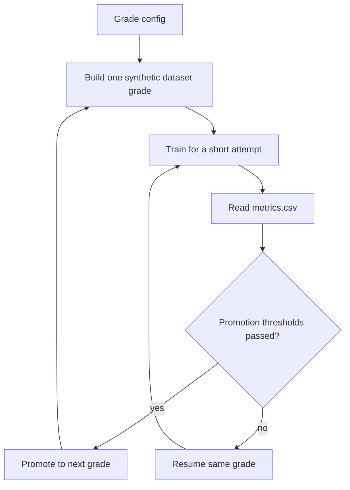

# Adaptive Curriculum Supervisor

The adaptive curriculum is a thin orchestration layer over the existing dataset builder and PyTorch trainer. It does not change the model. It changes the training schedule so SoundLearner can start with a deliberately tiny inverse problem and only move up when the current grade is actually passing.

## Goal

Instead of prebuilding a large fixed curriculum and guessing the right stage length:



This lets the machine spend time where the model is weak. The first configured grade is a single oscillator, then the ladder increases oscillator count only after validation metrics clear the configured thresholds.

## Run It

The current recommended high-resolution curriculum is `v2_2048`. It uses `2048x512` SLFT tensors, a width-192 encoder, fixed seven/eight-oscillator bridge grades, and a stricter variable-count grade.

Preview the commands without building or training:

```powershell
scripts\run_adaptive_curriculum_v2_2048.bat --dry-run --skip-native-build --stop-grade g01_single_oscillator
```

Start the full supervisor:

```powershell
scripts\run_adaptive_curriculum_v2_2048.bat
```

Run only through a specific grade:

```powershell
scripts\run_adaptive_curriculum_v2_2048.bat --stop-grade g03_three_oscillators
```

Resume behavior is automatic. The supervisor writes state under:

```text
runs/adaptive_curriculum_v2_2048/supervisor_state.json
runs/adaptive_curriculum_v2_2048/supervisor_history.csv
```

Use `--reset-state` when you want to ignore previous supervisor progress. Existing run folders are not deleted automatically. Fresh non-resume training clears the run's `metrics.csv`, so reset runs do not inherit stale validation rows.
Use `--reset-grade <name>` when only one rung changed and earlier promoted checkpoints should stay intact.

## Config

The current high-resolution config is:

```text
deep_trainer/configs/adaptive_curriculum_v2_2048.toml
```

Important sections:

- `[dataset]` controls generated samples, resolution, crop length, worker count, and f0 range.
- `[training]` controls the train chunk size and the CLI arguments forwarded to `deep_trainer.train`.
- `[[grades]]` defines each generated difficulty grade and its promotion thresholds.
- `[real_evaluation]` optionally runs the real-audio evaluation harness after promoted grades.

The first grade locks the oscillator frequency factor to the fundamental anchor. That matters because one oscillator with a free octave multiplier is not actually a trivial task: the same audible tone can be represented as several different base-note/multiplier pairs.

Adaptive curriculum training also enables model coordinate channels. Without explicit frequency position, the ConvNeXt-style encoder plus global average pooling can learn spectral shape while struggling to know where that shape sits on the log-frequency axis.

The `v2_2048` path uses `normalization = "group"` instead of BatchNorm. The high-resolution tensors force small GPU batches, and BatchNorm's running statistics can make validation pitch error bounce even while training pitch improves. Older checkpoints and configs still default to BatchNorm unless they explicitly opt into GroupNorm.

The current first grades are:

```text
g01: exactly 1 oscillator, fixed at 1.0*f0
g02: exactly 2 coupled oscillators, fixed at 1.0*f0 and 2.0*f0
g03: exactly 3 coupled oscillators, fixed at 1.0*f0, 2.0*f0, and 4.0*f0
g04: exactly 4 coupled oscillators, fixed at 1.0*f0, 2.0*f0, 4.0*f0, and 8.0*f0
g05: exactly 5 coupled oscillators, fixed at 1.0*f0 through 16.0*f0
g06: exactly 6 coupled oscillators, fixed at 1.0*f0 through 32.0*f0
g07: exactly 7 coupled oscillators with an explicit harmonic prefix
g08: exactly 8 coupled oscillators with an explicit harmonic prefix
g09: 4..8 coupled oscillators with an explicit harmonic prefix
```

Uncoupled oscillators are intentionally disabled for now. They can come back later as their own curriculum branch after the coupled harmonic model is stable.

Early grades use explicit `coupled_frequency_factors` so each rung adds one new concept at a time. This avoids mixing oscillator-count discovery with new harmonic placement before the model has learned the basic ladder.
Seven- and eight-oscillator bridge grades keep count fixed before the variable-count grade returns. This is intentionally slower, but it prevents the model from learning a one-size-fits-all active-slot pattern before it can hold the larger harmonic stacks.
Variable-count stages also use an explicit soft activity-count loss, because raw activity BCE can stay high even when pitch and rendered audio are improving.

Grades can override selected training settings such as `learning_rate`. The high-resolution curriculum drops later grades to `0.0001` once the fixed harmonic prefix is large enough that fine-tuning is more useful than fast movement.

Promotion checks use the best validation row from the grade's `metrics.csv`. Configured thresholds can include:

```text
max_val_loss
max_val_activity_loss
max_val_activity_count_loss
max_val_activity_soft_count_mae
max_val_activity_hard_count_mae
max_val_activity_probability_mae
max_val_parameter_loss
max_val_f0_loss
max_val_f0_cents_mae
max_val_crowding_loss
max_val_render_feature_loss
max_val_render_rms_loss
```

`val_f0_cents_mae` is especially important for the current failure mode, because the analysis frontend shows that timbre can look partly reasonable while predicted pitch is still badly wrong.

## Useful Overrides

Short experimental run:

```powershell
scripts\run_adaptive_curriculum_v2_2048.bat --samples-per-grade 100 --epochs-per-attempt 2 --max-attempts-per-grade 2 --stop-grade g01_single_oscillator
```

Use fewer dataset workers:

```powershell
scripts\run_adaptive_curriculum_v2_2048.bat --workers 4
```

Run real-audio evaluation after each promoted grade:

```powershell
scripts\run_adaptive_curriculum_v2_2048.bat --real-eval
```

Real evaluation uses `sounds/manifest.csv` by default and writes under:

```text
sounds/eval/adaptive_curriculum_v2_2048/<grade>/
```

## Reading Results

For each grade:

```text
runs/adaptive_curriculum_v2_2048/<grade>/metrics.csv
runs/adaptive_curriculum_v2_2048/<grade>/best.pt
runs/adaptive_curriculum_v2_2048/<grade>/last.pt
```

The supervisor records why it did or did not promote a grade in `supervisor_state.json`. If a grade keeps failing because only one metric is bad, that is a strong hint about where to work next:

- bad `val_f0_cents_mae`: pitch/f0 target or feature representation problem
- bad `val_parameter_loss`: label-space regression problem
- bad `val_activity_loss`: slot-count/activity problem
- bad `val_activity_soft_count_mae`: predicted oscillator count is off
- bad `val_render_feature_loss` or `val_render_rms_loss`: audio-space objective is not being satisfied
