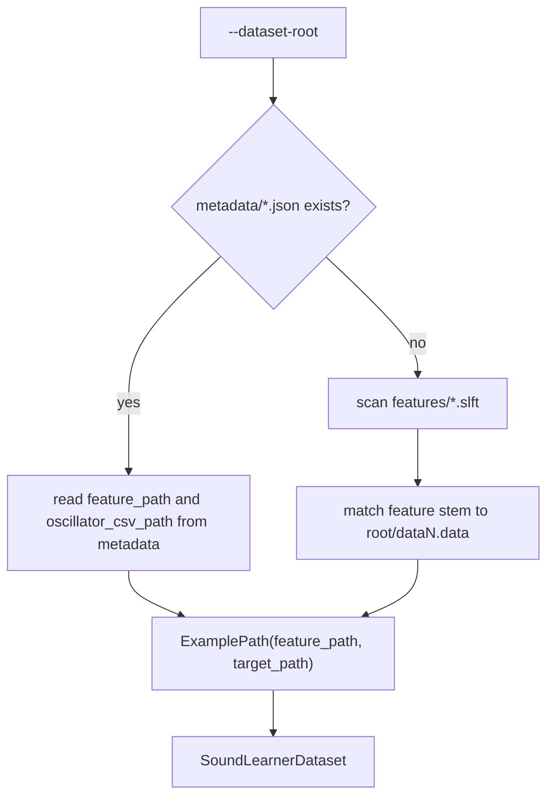

# Dataset Discovery

This note describes how the PyTorch trainer locates feature tensors and oscillator labels inside a dataset root.

## Expected Layout

The preferred dataset layout is:

```text
dataset-root/
  features/
    data0.slft
    data1.slft
  metadata/
    data0.json
    data1.json
  data0.data
  data1.data
```

The trainer expects `.slft` feature tensors and corresponding `.data` oscillator CSV labels.

## Preferred Path: Metadata-Driven Discovery

If `metadata/*.json` exists, the trainer reads each JSON file and resolves:

- `analysis.feature_path`
- `target.oscillator_csv_path`

These paths may be absolute or relative to the dataset root.

This is the preferred path because it makes the relationship between inputs and targets explicit.

## Fallback Path: Feature-Name Matching

If metadata is missing, the trainer falls back to scanning:

```text
features/*.slft
```

For each feature tensor:

```text
features/dataN.slft -> dataN.data
```

This fallback is convenient for older datasets, but it is less explicit than metadata-driven discovery.

## Discovery Flow



## Why This Is In `docs/`

This is important implementation detail, but it is not front-door README material. The top-level README should help a reader understand what SoundLearner is, where it is heading, and how to get moving. This page is for the deeper “how the trainer finds files” level.
