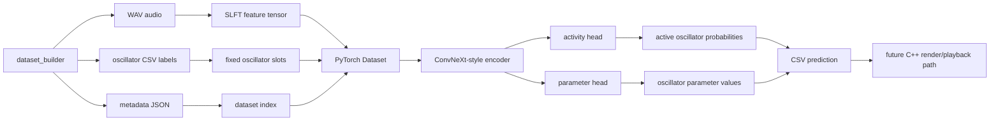
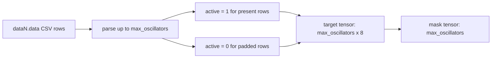
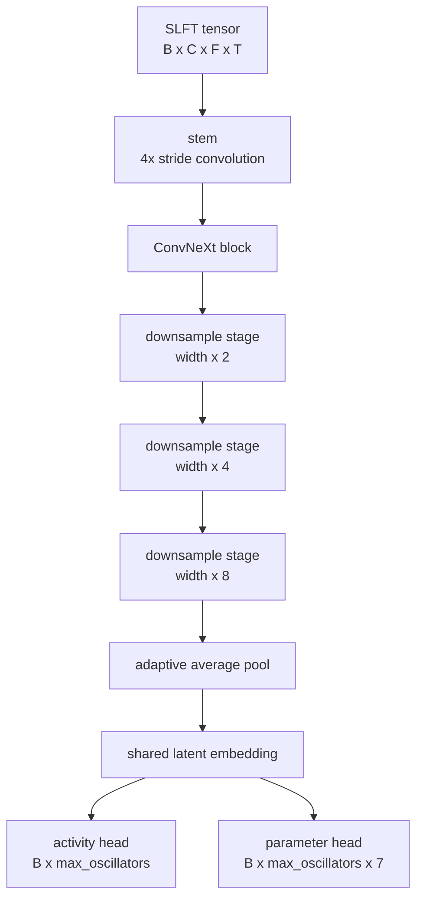

# SoundLearner Trainer

This directory contains the modern ML baseline for SoundLearner.

The legacy TensorFlow 1.x image trainer has been replaced with a PyTorch pipeline that trains directly on `.slft` feature tensors. The current goal is a supervised baseline: map audio features to oscillator-machine parameters, prove the end-to-end path, then improve the model once the failure modes are visible.

## Design Goal

SoundLearner is an inverse synthesis project:

```text
audio clip -> compact oscillator instrument -> rendered audio
```

The trainer does not try to generate waveform samples directly. It predicts the parameters of the existing oscillator model. That keeps the output small, inspectable, and usable by the C++ player.

## Architecture Overview



Generated audio gives us perfect labels. Real audio does not, so real clips should be treated as a performance benchmark after the synthetic baseline works.

## Files

```text
deep_trainer/
  slft.py                 binary .slft reader
  dataset.py              dataset discovery and label loading
  model.py                ConvNeXt-style baseline model
  losses.py               activity + parameter loss
  train.py                training CLI
  predict.py              prediction CLI
  evaluate.py             holdout evaluation harness
  dataset_augmentor.py    audio-domain augmentation for synthetic datasets
  analyze_parameter_space.py
                          PCA/SVD collapse analysis for predicted .data files
  cnn_model_trainer.py    compatibility wrapper for old script name
  model_predictor.py      compatibility wrapper for old script name
  requirements.txt        Python dependencies
```

## Data Layout

The trainer expects data generated by `dataset_builder`:

```text
dataset-root/
  features/
    data0.slft
    data1.slft
  metadata/
    data0.json
    data1.json
  data0.data
  data1.data
```

`metadata/dataN.json` is preferred because it explicitly links the feature tensor to the oscillator CSV target. If metadata is missing, the dataset loader falls back to matching:

```text
features/dataN.slft -> dataN.data
```

The lower-level discovery rules live in [dataset-discovery.md](./dataset-discovery.md).

## SLFT Tensor

The `.slft` format is the canonical ML input:

```text
magic:        SLFT
version:      1
sample_rate:  44100
shape:        channels x frequency_bins x time_frames
data:         float32, channel-major
```

Current channels:

1. Log-frequency magnitude.
2. Temporal delta.
3. Onset emphasis.

For a default 512-resolution dataset, one model input has shape:

```text
3 x 512 x 512
```

Rectangular tensors are supported:

```text
3 x 1024 x 512
3 x 2048 x 512
3 x 4096 x 512
```

Preview BMP/PPM images are only for humans. The trainer should not depend on image files.

## Label Format

Each instrument is encoded as a fixed number of oscillator slots. The default is `64` slots.

Each slot has 8 values:

```text
active
start_amplitude_factor
start_frequency_factor
phase_factor
amplitude_decay_factor
amplitude_attack_factor
frequency_decay_factor
base_frequency_coupled
```

The `active` flag lets the model represent variable oscillator counts while keeping a fixed output shape.



Rows beyond `--max-oscillators` are ignored.

## Model

The current model is a small ConvNeXt-style encoder, implemented in `model.py`.



The two-head output matters:

1. The activity head predicts which oscillator slots are present.
2. The parameter head predicts values for active oscillator slots.

All parameter outputs are passed through `sigmoid`, because the current oscillator CSV values are normalized to `0..1`.

## Loss

```text
total_loss = activity_weight * BCE(activity_logits, active_flags)
           + parameter_weight * masked_smooth_l1(parameters, target_parameters)
```

Default weights:

```text
activity_weight = 1.0
parameter_weight = 10.0
```

The parameter loss is masked so padded inactive slots do not dominate training.

## Training

Install dependencies:

```bash
python -m pip install -r deep_trainer/requirements.txt
```

Smoke train:

```bash
python -m deep_trainer.train --dataset-root . --epochs 2 --batch-size 4 --resolution 256 --amp --output-dir runs/smoke
```

Baseline train:

```bash
python -m deep_trainer.train --dataset-root datasets/synth_256_1k --epochs 30 --batch-size 8 --resolution 256 --amp --output-dir runs/baseline_256_1k
```

Rectangular train:

```bash
python -m deep_trainer.train --dataset-root datasets/synth_2048x512_1k --epochs 30 --batch-size 2 --freq-bins 2048 --time-frames 512 --amp --output-dir runs/baseline_2048x512_1k
```

Useful options:

```text
--config configs/run.toml
--max-oscillators 64
--learning-rate 3e-4
--weight-decay 1e-4
--validation-split 0.15
--width 64
--dropout 0.1
--num-workers 0
--seed 1337
--amp
--tensorboard
--resume runs/previous/last.pt
--init-checkpoint runs/previous/best.pt
```

### Config Files

Training parameters can live in a TOML or JSON file instead of a long shell command.

Example:

```bash
python -m deep_trainer.train --config deep_trainer/configs/curriculum_v1_clean.toml
```

CLI flags still override config-file values.

### Checkpoint Continuation

`train.py` supports:

```text
--resume            continue the same run, including optimizer state and epoch count
--init-checkpoint   load model weights only, then start a fresh run
```

Use `--resume` when the dataset and run are the same. Use `--init-checkpoint` for curriculum fine-tuning.

### Metrics Dashboard

Each run writes:

```text
runs/<run-name>/metrics.csv
```

Use `--tensorboard` to also write TensorBoard event logs:

```bash
python -m deep_trainer.train --dataset-root datasets/synth_256_1k --epochs 100 --batch-size 16 --resolution 256 --amp --tensorboard --output-dir runs/baseline_256_1k_long
```

Start TensorBoard:

```bash
tensorboard --logdir runs
```

## Prediction

```bash
python -m deep_trainer.predict --checkpoint runs/baseline/best.pt --feature features/data0.slft --output prediction.data
```

Useful flags:

```text
--write-all-slots
--activity-threshold 0.35
```

## Evaluation Harness

`evaluate.py` runs the full comparison loop for real holdout audio:

```text
real WAV
  -> source SLFT + preview
  -> checkpoint prediction
  -> predicted oscillator .data
  -> C++ player render
  -> rendered SLFT + preview
  -> summary metrics
  -> A/B listen folder + mel spectrogram PNGs
```

Single-file evaluation:

```bash
python -m deep_trainer.evaluate --checkpoint runs/baseline_256_1k/best.pt --input sounds/o_a2_1.wav --output-dir sounds/eval/o_a2_1_eval --resolution 256
```

Manifest evaluation:

```bash
python -m deep_trainer.evaluate --checkpoint runs/baseline_256_1k/best.pt --manifest sounds/manifest.csv --output-dir sounds/eval/baseline_256_1k --resolution 256 --limit 10
```

## Parameter-Space Analysis

When predictions start sounding suspiciously similar, analyze the oscillator vectors directly.

The analyzer writes:

- `pc_coordinates.csv`
- `parameter_variance.csv`
- `summary.json`
- `scatter.svg`
- `singular_values.svg`
- `pairwise_distance_histogram.svg`
- `report.md`

Example:

```bash
python -m deep_trainer.analyze_parameter_space --dataset-root datasets/synth_1024x512_1k --evaluation-root sounds/eval/baseline_1024x512_1k_b4_e40_10 --output-dir sounds/eval/baseline_1024x512_1k_b4_e40_10/analysis
```

## Curriculum Scripts

Windows batch helpers:

```text
scripts/build_curriculum_v1.bat
scripts/train_curriculum_v1.bat
scripts/build_complexity_curriculum_v1.bat
scripts/train_complexity_curriculum_v1.bat
```

## Interpreting Loss

Rule of thumb:

```text
val_activity low, val_params flat -> model learned active slots but needs more data or better parameter supervision
train_loss down, val_loss up      -> overfitting
both losses flat                  -> pipeline, labels, learning rate, or architecture issue
```

## Current Limitations

1. It predicts fixed oscillator slots, so slot ordering matters.
2. It has no audio reconstruction loss yet.
3. It does not rank multiple plausible oscillator solutions.
4. It does not train on real audio labels, because real audio has no oscillator ground truth.
5. It assumes parameter values are normalized to `0..1`.

## Next Improvements

1. Add a dataset manifest writer so training does not rely on directory scanning.
2. Add validation summaries as JSON/CSV.
3. Add per-parameter loss metrics.
4. Add parameter-specific loss weights.
5. Add predicted-instrument rendering and audio-space evaluation.
6. Add domain randomization to generated training data.
7. Add uncertainty or mixture-density heads for ambiguous inverse mappings.

## References

Selected references:

1. [ConvNeXt](https://arxiv.org/abs/2201.03545)
2. [PyTorch AMP examples](https://docs.pytorch.org/docs/stable/notes/amp_examples.html)
3. [AdamW](https://arxiv.org/abs/1711.05101)
4. [PyTorch serialization semantics](https://docs.pytorch.org/docs/stable/notes/serialization.html)
5. [Audio Spectrogram Transformer](https://arxiv.org/abs/2104.01778)
6. [CLAP](https://arxiv.org/abs/2206.04769)
7. [BEATs](https://arxiv.org/abs/2212.09058)
8. [Mixture Density Networks](https://publications.aston.ac.uk/id/eprint/373/1/NCRG_94_004.pdf)
9. [DDPM](https://arxiv.org/abs/2006.11239)
10. [DDIM](https://arxiv.org/abs/2010.02502)
